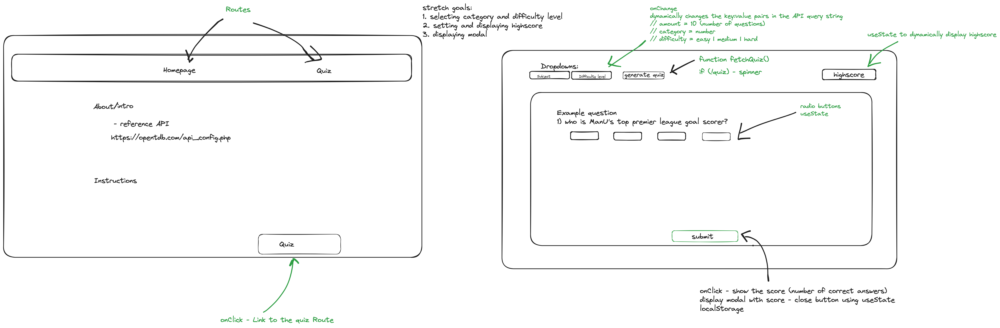
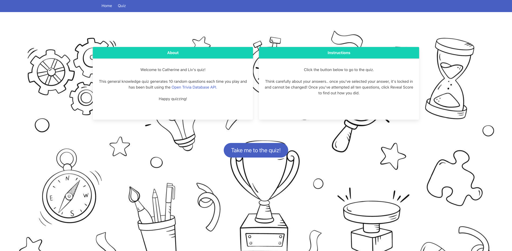
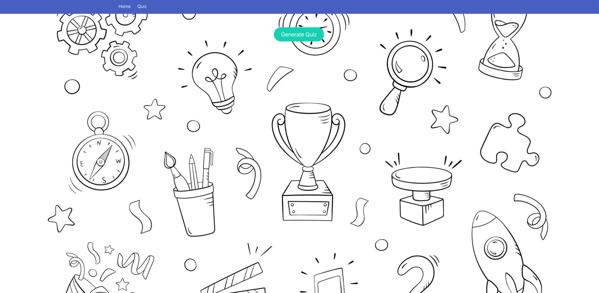
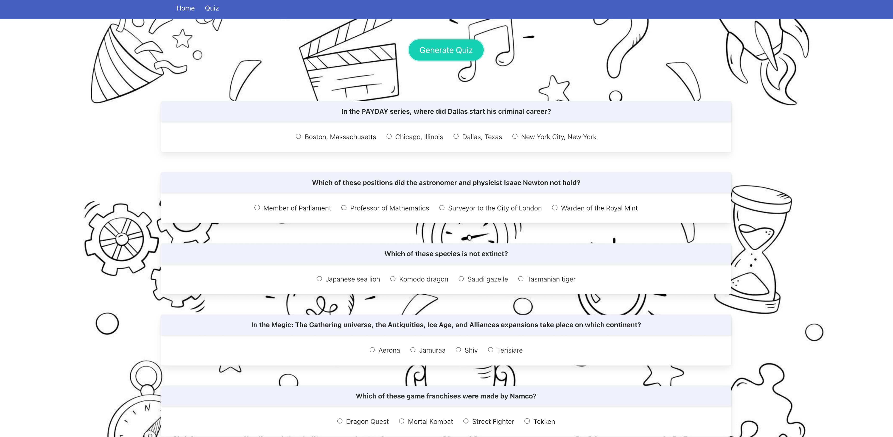
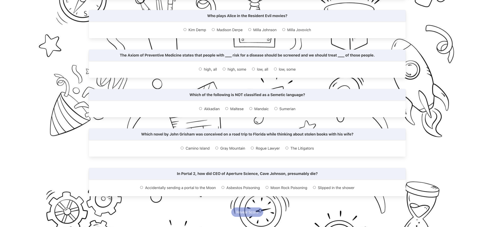

# General Assembly Project 2: Quiz app

## Description

Halfway through General Assembly’s 12-week Software Engineering Bootcamp, my cohort had a two-day hackathon where we worked in pairs to build a React application, given some basic starter code. The application needed to include a router, to have two or more “pages”, and to consume a public API. My teammate Liv Darby and I decided to use the [Open Trivia Database](https://opentdb.com/api_config.php) to build a quiz app.

You can find our project [here](https://catherine-liv-project-2.netlify.app/).

## Getting Started/Code Installation

- Make sure you have [Node.js](https://nodejs.org/en/download) and [npm](https://www.npmjs.com/package/npm) installed
- Clone the repo
- Run `npm install` in your terminal
- Run `npm run dev` in your terminal to open the quiz in your browser

## Technologies Used

- VS Code
- Git / GitHub
- Node.js
- Vite
- TypeScript / TSX
- React
- React Router
- Bulma
- CSS
- Open Trivia API
- Insomnia
- Netlify

## Brief

Your React app must:

- Consume a public API 
- Include a router - with two or more "pages"
- Include wireframes 
- Have semantically clean HTML 
- Be deployed online and accessible to the public

## Planning

Step one of the project was to find a good quality public API and to come up with an idea of how we might want to use the data in a React app. Liv and I compared the results of the research we had done independently before being paired, and decided to build a two-page quiz app using the Open Trivia API. It would have a homepage with an intro which credited the API, plus some basic instructions, and a button linking through to the quiz page (also linked via a navbar). A button on the quiz page would fetch the data, and 10 multiple-choice questions would display on the page. The button at the bottom would reveal the user’s score. Our initial wireframe is included here:



Once the wireframe was complete, we considered which of these elements a user would be expecting from an MVP. On this basis, we decided that given the tight turnaround, the difficulty level/category dropdowns and the high score/modal should be stretch goals, and incorporated only if time allowed.

We chose to begin by pair-programming and taking turns as driver/navigator. We agreed we would designate individual tasks further down the line if we found that it made more sense to do so, or that we needed a break from talking! 

## Build/Code Process

In fact, Liv and I found we very much enjoyed working together, were learning a lot from the process, and were making good progress. As a result, we didn’t work independently of one another until the final few hours of the project when the time pressure was greater and there was some much-needed styling still to be done! (Here, we agreed on a basic look and then took responsibility for a page each, reconvening afterwards to agree on any tweaks.) 

In terms of the build, on Day One we began with an initial commit of the starter code. Then to get our basic structure in place, we consulted our wireframe and created components for the navbar, and the home and quiz pages. We set our parent component up with the appropriate imports, a router, routes to the home and quiz pages, and also linked to them from the navbar. We made components for the About and Instructions sections, and imported them to use in the Home component.

On Day Two, our first (and only) full day, we made dropdowns for our category and difficulty level “`select`” elements (not strictly `select` elements as we were using Bulma, whose dropdowns use anchor tags):

```
<div className="dropdown-menu" id="dropdown-menu" role="menu">
  <div className="dropdown-content">
    <a href="#" className="dropdown-item">
      General knowledge
    </a>
```

Sadly, we ran out of time to make use of these in the end! 

We made a component for the “Take me to the Quiz” button, and were unsure initially about where it should live, as we were struggling to get it to link through to the quiz page. We decided that it was non-essential as the navbar already linked to the quiz page, and so as the clock was ticking, it would be better to park the issue and come back to it with fresh eyes once we’d achieved something more crucial!

Next, we created a `GenerateQuizButton` component to fetch the data from the API, map through it, and pass the relevant items (questions, correct answers and incorrect answers) as props to a `ShowQuestions` component. This latter component would (we believed!) render the questions on the page. 

However, the questions were not appearing on the quiz page as expected, and after discussing the issue with a more experienced engineer, we realised there was something amiss with where our state was living. We got rid of the separate `GenerateQuizButton` component and moved its state and `fetch` function up to the `QuizPage` component. We mapped the data and passed the props down to `ShowQuestions` from here instead. 

In the `ShowQuestions` component we then combined and “shuffled” our correct and incorrect answers together (see “Wins” section below). We created some state to track the user’s selected answer, a function to check if the string they’d selected was equal to the value of the correct answer prop —

```
const [selectedAnswer, setSelectedAnswer] = React.useState(null as any);
console.log(selectedAnswer);

function handleAnswerSelection(e: any) {
  setSelectedAnswer(e.currentTarget.value);
  increaseNoOfAnswers();
  console.log(e.currentTarget.value);
  console.log(correct);
  if (e.currentTarget.value === correct) {
    increaseFunction();
  }
}
```

— and a variable to track their score. We returned some TSX to render the questions and answers on the page, with radio buttons for the answers.

We then realised we needed states for (1) the user’s score, (2) to manage whether their score was visible, and (3) to track how many questions they had answered. We passed the relevant props down to `ShowQuestions`. We then did battle with (1) a radio button issue, (2) how to track the user’s progress/score if we were allowing them to change their mind, and (3) managing when they could see their score (see “Challenges” for details!).
To wrap up Day Two, we wrote some code to tell the user if each of their answers was correct or incorrect, once their score was revealed.

On Day Three we only had a few hours before presenting to the rest of the group, so we began with deployment so we could be confident our project was online and that the rest of the time was ours to play with. 

We were happy with the functionality but hadn’t yet styled the app, so once we’d agreed on a basic look, Liv took the home page while I took the quiz page, and we reconvened later to make some final decisions together and ensure there was consistency across both. We also added a spinner for while the questions were being fetched the first time around —

```
{buttonIsClicked &&
  (!questions ? (
    <p className="spinner"></p>
  ) : (
    questions.map((element: any, i: any) => {
      return (
        <ShowQuestions           
```

— and some confetti from a library for when the user reveals their score. Other things we would like to have done if we’d had more time are detailed in the Further Improvements section below.

## Challenges

When we were working on the logic for capturing the user’s selected answer and tracking their score, we found that when we selected an answer to question two, the user’s answer to question one was removed, and so on. We also had a function to update the user’s score, adding one point for a correct answer. However, because the user could change their mind, we needed to deduct the point if they then swapped to an incorrect answer. We quickly saw that this wasn’t controlled enough and was not going to produce an accurate score, or even necessarily a score within the range of zero to 10! We suspected that the best solution to the second problem would be to lock the user’s answer in as soon as they had made a selection.

We received some advice that the radio button selection was moving between questions because the questions’ `name` attributes were not unique enough. We therefore passed a prop of `id={i}` down from our `QuizPage` component to our `ShowQuestions` component, and gave each question’s answer group a name corresponding to that `id`, which solved the issue. 

We then made use of our `selectedAnswer` state by converting it to a Boolean, and when it was `true` (i.e. when an answer had been selected for a given question), we disabled the radio buttons for that question, the user’s selection was locked in, and the unreliable scoring issue was solved:

```
<label className="radio mr-4">
  <input
    className="mr-2"
    disabled={!!selectedAnswer}
    onChange={handleAnswerSelection}
    type="radio"
    name={`answer-${id}`}
    value={shuffledAnswers[0]}
  />
  {shuffledAnswers[0]}
</label>
```

Once we had decided to reveal the user’s score only after they had answered all 10 questions, another challenge we faced was coming up with a way of tracking how many questions they had answered, regardless of whether they were wrong or right. We thought through a number of ideas, including creating an array of strings out of each selected answer, and then I realised that we were over-complicating things and all we needed was a number! We created a `numberOfAnswers` state (starting at zero at the beginning of the quiz), and a function, using `setState`, to increase `numberOfAnswers` by one each time an answer was selected and locked in. We then made the Reveal Score button clickable only when the `numberOfAnswers` was (strictly) equal to 10:

```
{questions ? (
  <div className="has-text-centered">
    <button
      className="button is-link is-rounded "
      disabled={numberOfAnswers !== 10}
      onClick={revealScoreClick}
    >
      Reveal Score
    </button>
```

## Wins

I am particularly pleased with the visual design of our finished project, especially as we had only a couple of hours to style it at the end, and the Bulma CSS framework was still very new to us.









I am also very happy with how the pair-programming went. We communicated effectively, listened to each other, compromised quickly and easily, helped each other when we were struggling to grasp something, and most importantly, really enjoyed working together.

In terms of problem solving, one of our particular wins was around the correct vs incorrect answers logic. We realised that having added the correct answer to the array of incorrect answers, unless we mixed them up, a user would be able to figure out that the last of the four answers was always the correct one. We did some research into complicated ways of shuffling arrays, but it then occurred to me that it would be simpler just to use a method we had already seen: `sort`. If the answers (strings) were reordered alphabetically, then they were still being rearranged, if not randomly shuffled – but that was all we needed to prevent the user knowing which was the correct one! We sought guidance on creating the array of all four answers using the `spread` syntax, after figuring out (via a bit of trial and error and then some googling!) that the `push` method was returning the array’s length, as opposed to a new array!

```
const allAnswers = [...incorrect, correct];
console.log("All answers are: ", allAnswers);
const shuffledAnswers = [...allAnswers].sort();
console.log("Shuffled answers are: ", shuffledAnswers);
```

## Key Learnings/Takeaways

I was very new to Bulma when we began working on this project, having only tried it briefly once before. I now feel much more confident using it, can really appreciate how frameworks like this could help me in future, and look forward to trying them again and learning even more about what they can do.

I also learned about radio groups and how to tackle them, and this will undoubtedly save me time when I meet them again! Equally, I am now unlikely to forget that the `push` method does NOT return an array!

Lastly, when researching how to deal with an issue of HTML entities rendering on the page (see Future Improvements), I learned about `dangerouslySetInnerHTML` (and why it is not best practice given its vulnerability to XSS attacks).

## Bugs

While there are certainly improvements we would make if we had more time (see below), there are no (known!) “bugs” per se.

## Future Improvements

Improvements I would make to this project, and would have implemented if we’d had more time, include:

- Tidying up the code and clearing out anything that ended up being redundant, and also renaming some of the functions and variables for improved readability/expression of intent

- Removing the HTML entities, potentially by mapping through the data as soon as it is fetched and replacing the most common instances, e.g. `&quot;`

- Looking at the stretch goals, for example dynamically updating the API endpoint based on a user’s selected difficulty level and category

- Replacing instances of `any` as a type declaration

